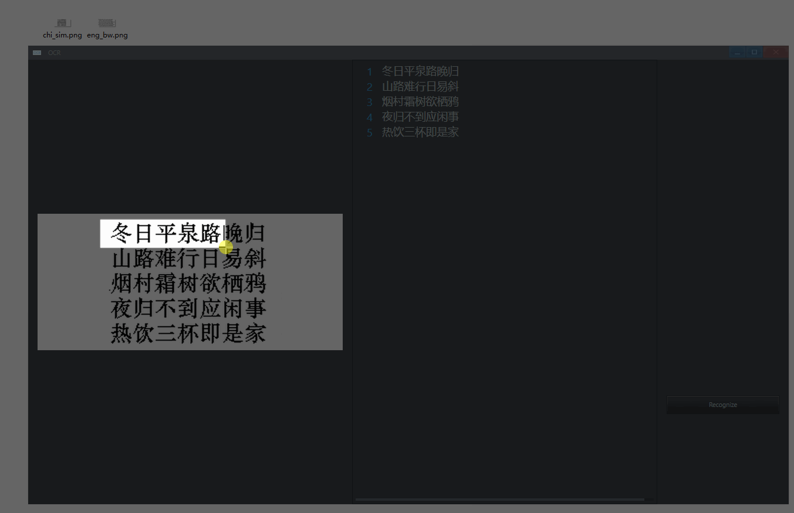

<p align="center">
    
</p>

<!-- <h1 align="center">OCR</h1> -->

<div align="center">

[](https://github.com/rerender2021/ocr-2/actions/workflows/build.yml) [](https://github.com/rerender2021/ocr-2/actions/workflows/pack.yml)

 </div>
 
# Introduction

This is powered by [Avernakis React](https://qber-soft.github.io/Ave-React-Docs/) & [Paddle OCR](https://github.com/PaddlePaddle/PaddleOCR). 😀

It supports Chinese and English out of box.

# Install

Download it from [Github Release](https://github.com/rerender2021/ocr-2/releases).

# Features

## drag and drop to open


## paste from clipboard or file

- `Ctrl + V`: paste image from clipboard or file




## copy text to clipboard

- `Ctrl + C`: copy recognized text to clipboard


# Dev

```bash
> npm install
> npm run dev
```

This launches the frontend, we need backend to provide OCR API.

Download the paddle ocr server from [PaddleocrAPI](https://github.com/rerender2021/PaddleocrAPI/releases/) and place it at `paddle-server`.


# Package

1. build the frontend

```bash
> npm run release
```

2. copy `paddle-server` to `bin`


# License

[MIT](./LICENSE)
